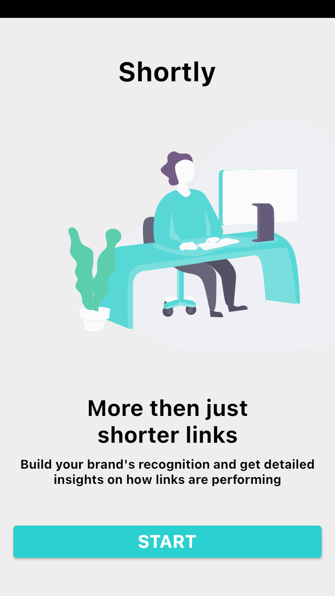
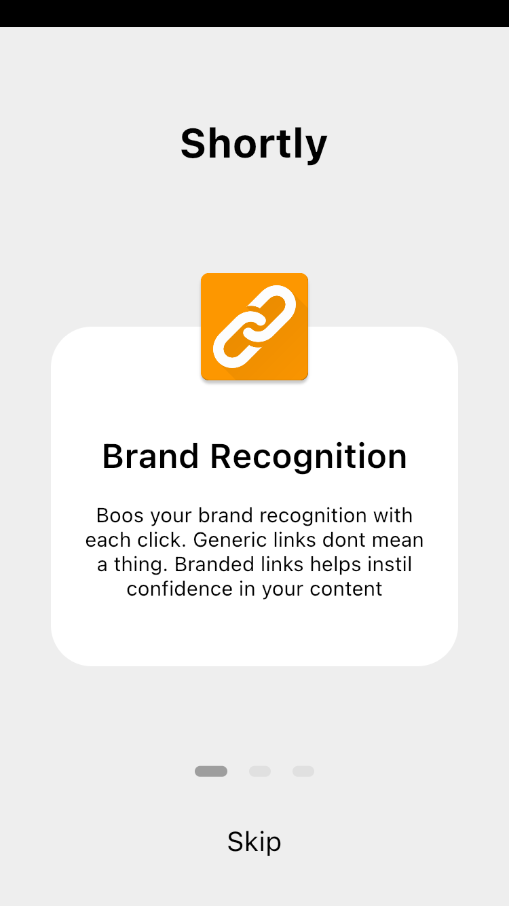
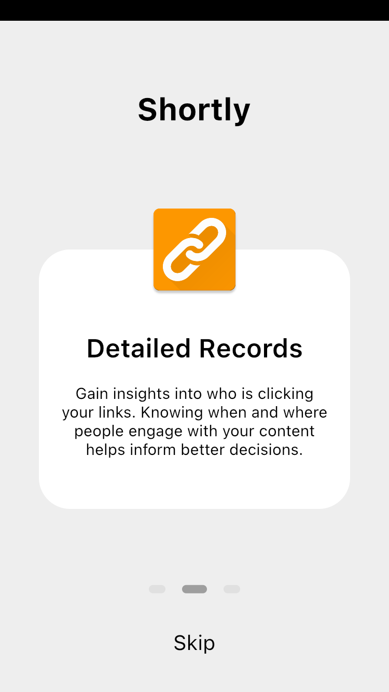
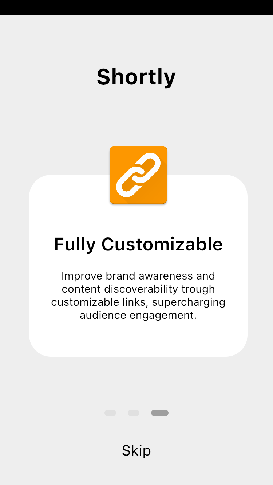
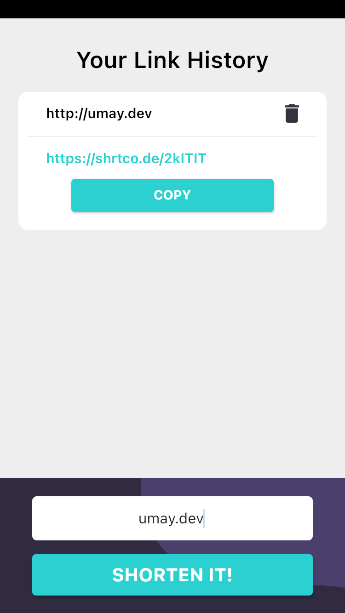
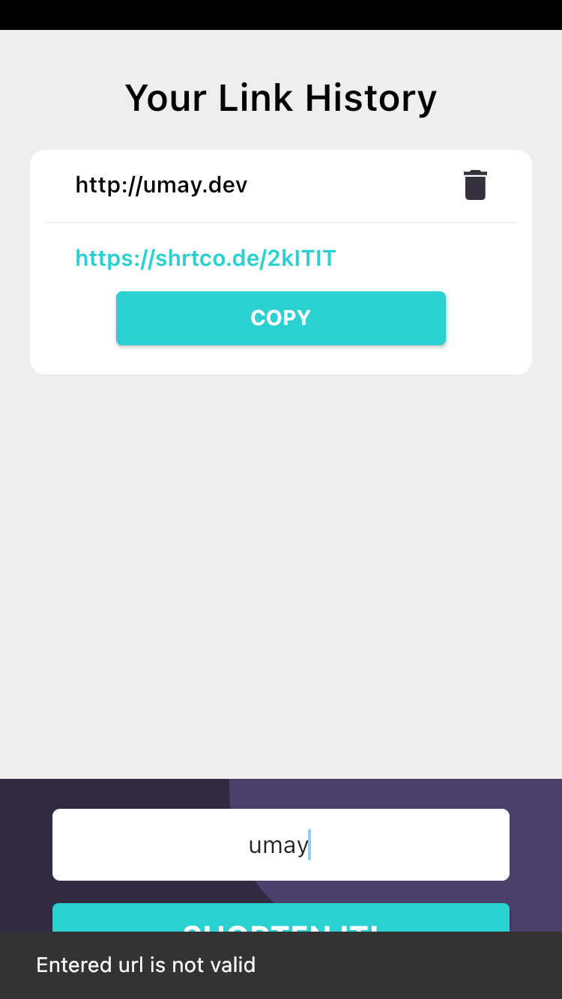
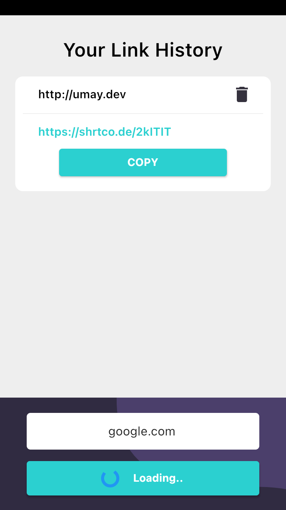
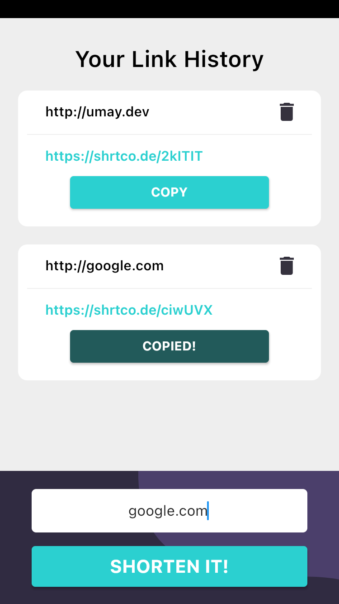

# Shortly App

Shortly App, flutter ile yazılmıştır. Url adreslerini kısaltarak paylaşmak amaçlanmıştır.

   

# Library | Use
provider: ^6.0.0
 flutter_svg: ^0.22.0
 dio: ^4.0.0

# How to
Uygulamada öncelikle welcome ekranı ve onboarding ekranları hazırlanmıştır. Svg dosyaları için flutter_svg paketi kullanılmıştır. Onboarding ekranı 3 bölüm halinde planlanmıştır. 
Tanıtım ekranlarının ardından uygulamanın ana işlevinin olduğu ekranlar hazırlanmıştır. Dio paketi ile post/get işlemleri yapılmıştır. Ardından elde edilen json parse edilerek gerekli bölümler listelere eklenmiştir. Provider paketi ile state yönetimi sağlanmış ve kullanıcı deneyimi iyileştirilmiştir. 
  
   

   

* Uygulama, Iphone SE (2nd Generation) emülatörü üzerinde test edilerek geliştirilmiştir. Kısıtlı zaman nedeniyle responsive tasarım özelliği sunmaz. 
* Uygulama ekran görüntülerine ve video içeriklerine App_Shortly klasöründen ulaşılabilir. 
